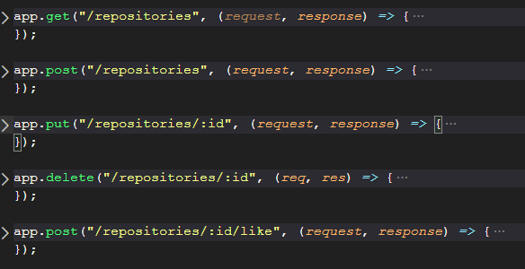

<!-- # bootcamp-gostack-desafios -->

<h3 align="center">  Desafio 1 - Planejando meus estudos </h3>

### Sobre o desafio

Neste desafio foi proposto que fosse feito um crud de repositorios do Github.

Utilizando uma lib chamada uuid para gerar os id´s unicos.

### As rotas

Um crud para quem não sabe é feito dos seguintes metodos:

- Create
- Update
- Read (list)
- Delete

- Rota para Listar  
    url : /repositories, 

- Rota para criar
    url : /repositories
    parametros : title, url, techs 

- Rota para alterar
    url : /repositories/:id,
    parametros :  título, url, techs, id do repositorio que vem no header da requisição

- Rota para deletar
    url : /repositories/:id,
    parametros : id do repositorio que vem no header da requisição 

- Rota para incrementar likes
    url : /repositories/:id/likes,
    parametros : id do repositorio que vem no header da requisição 

---

> Conceitos do foguete. 
