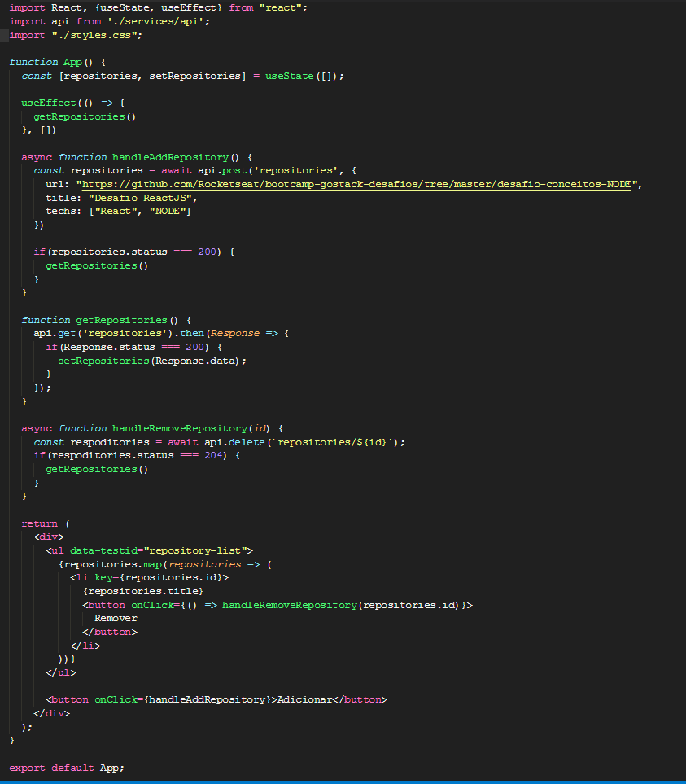

<!-- # bootcamp-gostack-desafios -->

<h3 align="center">  Desafio 1 - Conceitos NodeJs </h3>

### Sobre o desafio

Aplicação para listar, adicionar e remover repositories através da api feita no desafio de conceitos de NodeJs

### O Código

Um crud para quem não sabe é feito dos seguintes metodos:

- Create : através da função handleAddRepository
- Read (list) : através da funcão 
- Delete : atravpes da funcão handleRemoveRepository

---

> Conceitos do foguete. 
