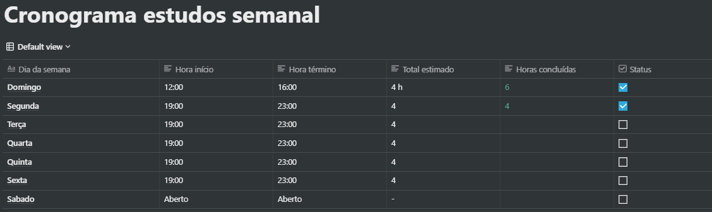
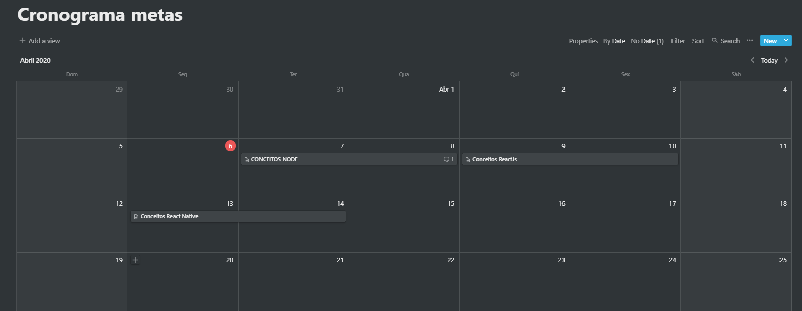

<!-- # bootcamp-gostack-desafios -->

<h3 align="center">  Desafio 1 - Planejando meus estudos </h3>

#### Sobre o desafio

Neste desafio foi proposto que eu planejasse meus estudos.

E para isto foi necessário a elaboração de duas ferramentas que iram me ajudar muito,
ferramentas estas que são um cronograma semanal e um crinograma diário das atividades que
estarei estudando durante este bootscamp.

#### Cronograma semanal

Neste cronograma ataptei umas funcionalidades a mais para controlar meu andamento nos estudos, são elas:

- Dia da semana - começando pelo domingo
- Horario de inicio
- Horario de fim
- Total estimado
- Horas concluídas
- Status - Checkbox informando se as horas diárias foram concluídas.

PS: Os horarios de descanço estão acoplados dentro destes totalizadores em modo de estudo por pomodore, a estimativa foi colocada abaixo do que realmente costumo estudar onde as vezes alcanço entre 8 a 10 horas de estudo, pois tenho costume de estudar no período da manhã também nos finais de semana e feriados.

---

#### Cronograma semanal

Cronograma agora semanal apontando qual a tarefa específica que estarei trabalhando.

---

> Conceitos do foguete. 
